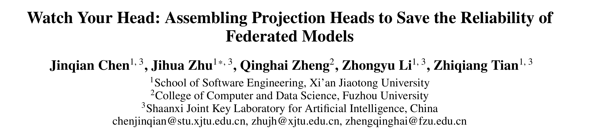
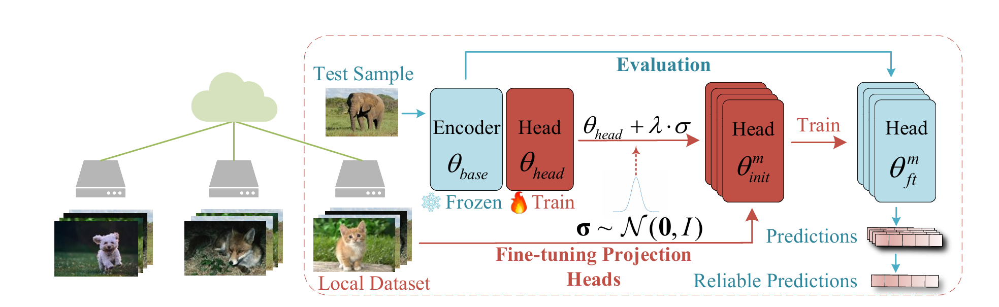

# Introduction

This is the official implementation of our paper：<a href='https://ojs.aaai.org/index.php/AAAI/article/view/29012'>Watch Your Head: Assembling Projection Heads to Save the Reliability of Federated Models</a>.



# Quick Start
Install the required enviroment via:
```
conda env create -f freeze.yml
```
